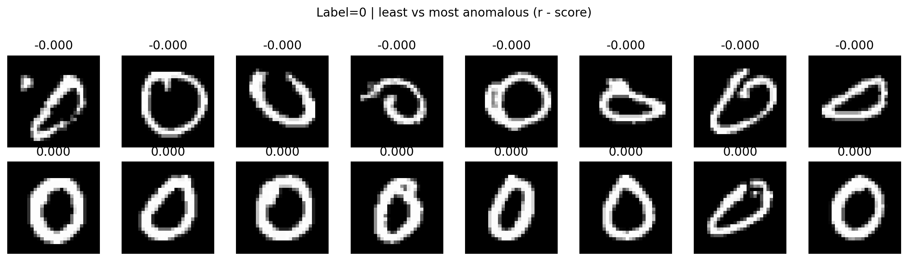
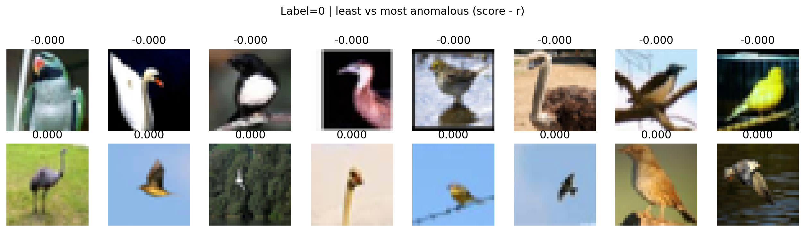
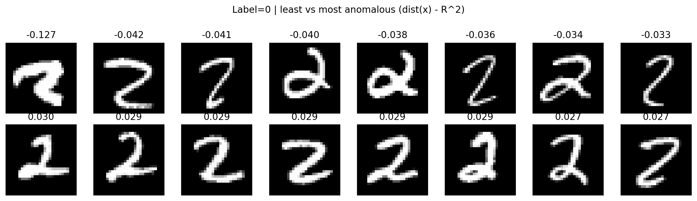

# On anomaly detection 
Laboratory repository for one-class anomaly detection on MNIST and CIFAR-10 using Autoencoders and deep one-class objectives, such as OCNN and SVDD.
building upon the formulations introduced in the following articles:

>Chalapathy, R., Menon, A. K., & Chawla, S. (2018).
>One-Class Neural Networks.
>Proceedings of the AAAI Conference on Artificial Intelligence (AAAI).
>https://arxiv.org/abs/1802.06360

>Ruff, L., Vandermeulen, R. A., Görnitz, N., Deecke, L., Siddiqui, S. A., Binder, A., Müller, K.-R., & Kloft, M. (2018).
>Deep One-Class Classification.
>Proceedings of the 35th International Conference on Machine Learning (ICML).
>https://arxiv.org/abs/1801.05365

<details> <summary>How to run the project?</summary>
Create environment (example): 

```
python -m venv ocnn_env
source ocnn_env/bin/activate
pip install -r requirements.txt
```

Let's run the ocnn pipeline!

```
sh command_cifar_ocnn.sh
sh command_mnist_ocnn.sh
sh command_mnist_svdd.sh
```
> Always check the configuration / CLI arguments before running: results depend strongly on ν, encoder LR, and AE pretraining.

</details>

<details><summary> Project structure </summary>

<br>

```
.
├── command_*.sh            # Reproducible experiment launch scripts
├── main_ocnn.py            # Entry point: OC-NN training & evaluation
├── svdd_main.py            # Entry point: Deep SVDD training & evaluation
│
├── model_utils/            # Training procedures (losses, optimization, pretraining)
│   ├── pretrain_autoencoder.py
│   ├── train_ocnn.py
│   └── train_svdd.py
│
├── models/                 # Neural network architectures (no training logic)
│   ├── autoencoder*.py     # Feature extractors
│   ├── ae_factory.py       # Model builder
│   └── ocnn.py             # OC-NN network definition
│
├── pipeline/               # Full experiment pipelines (dataset-specific workflows)
│   ├── run_*_ocnn.py
│   └── run_*_svdd.py
│
└── utils/                  # Infrastructure & data handling
    ├── *_datamodule.py     # Dataset loading & preprocessing
    ├── Config.py           # Experiment configuration
    ├── models_io.py        # Model saving/loading
    ├── plot_utils.py       # Visualization
    └── run_utils.py        # Experiment helpers
```


</details>

 ## 🧪 Experiment 1 — OCNN 
 In this experiment we evaluate One-Class Neural Network (OCNN) as a deep one-class objective for anomaly detection on MNIST.
 
Starting from a latent representation z ∈ ℝᵈ learned by an Autoencoder (AE), the One-Class Neural Network (OCNN) learns: a scoring function f(z), a threshold r, such that only a small fraction ν of the training samples violates the one-class constraint. The threshold r is updated iteratively as the ν-quantile of the scores produced by the network.
>Goal.
>Learn a decision function that assigns low scores to normal samples and flags deviations as anomalies.


<details> <summary>Results on Mnist</summary>

### Quantitative Results

| Method | Digit | ν | AUROC | 
|------|-------|----|-------| 
| DCAE + OCNN (joint) | 0 | 0.01 | 0.9662 | 
| DCAE + OCNN (joint) | 1 | 0.01 | 0.9798 | 
| DCAE + OCNN (joint) | 2 | 0.01 | 0.8786 | 
| DCAE + OCNN (joint) | 3 | 0.01 | 0.8787 | 
| DCAE + OCNN (joint) | 4 | 0.01 | 0.9147 | 
| DCAE + OCNN (joint) | 5 | 0.01 | 0.8369  | 
| DCAE + OCNN (joint) | 6 | 0.01 | 0.9659  | 
| DCAE + OCNN (joint) | 7 | 0.01 | 0.9170 |
| DCAE + OCNN (joint) | 8 | 0.01 | 0.9255  |  
| DCAE + OCNN (joint) | 9 | 0.01 | 0.9466  | 

### Extreme Normal Samples

The following figure shows the **most anomalous and least anomalous samples among the normal class**, according to the OCNN score.
Even though all samples belong to the same (normal) digit, the model assigns significantly different anomaly scores, highlighting variations in writing style, stroke thickness, and shape complexity.

<p align="center">
  
</p>

</details>

<details> <summary>Results on CIFAR10</summary>

### Quantitative Results

| Method | Digit | ν | AUROC | 
|------|-------|----|-------| 
| RCAE + OCNN (joint) | airplane | 0.1 | 0.6169 | 
| RCAE + OCNN (joint) | bird | 0.1 | 0.6382 | 


**Least vs most anomalous samples (normal class only).**  
The figure shows, for the normal class (label = 0), the samples with the lowest and highest anomaly scores according to the OCNN decision function \( r - f(x) \).

The bottom row contains the *leat anomalous* samples, which correspond to prototypical instances of the class: clear object appearance, canonical viewpoints, and low background clutter.  
The top row shows the *most anomalous* samples within the same class. Although still correctly labeled as normal, these images exhibit unusual viewpoints, strong background clutter, scale variations, or atypical visual patterns.

<p align="center">
  
</p>

</details>

 ## 🧪 Experiment 2 — SVDD
In this experiment we evaluate Deep Support Vector Data Description (DeepSVDD) as a deep one-class objective for anomaly detection on MNIST and CIFAR-10.
Starting from a latent representation z ∈ ℝᵈ learned by an Autoencoder (AE), DeepSVDD learns a representation that maps normal data close to a hypersphere center c in latent space.
The anomaly score is defined as the (squared) distance of a sample from the center c. Two training objectives are considered:
One-class DeepSVDD, which minimizes the average distance to the center;
Soft-boundary DeepSVDD, which additionally learns a radius R such that a fraction ν of samples is allowed to lie outside the hypersphere.
The center c is initialized as the mean of latent representations computed on the training set, and the network is optimized to compact normal samples while pushing anomalies away.
>Goal.
>Learn a compact representation of normal data in latent space, such that deviations from this compact region can be effectively identified as anomalies.

<details> <summary>Results on MNIST</summary>

| Method | Digit | AUROC | 
|------|-------|-------|
| RCAE + DEEP SVDD (normal/softbound) | 0 | 0.9973/ 0.9788 | 
| RCAE + DEEP SVDD (normal/softbound) | 2 |  0.8796/0.8993  | 

**Least vs most anomalous samples (normal class only).**  
The following figure shows the most anomalous and least anomalous samples among the normal class, according to the DeepSVDD anomaly score (distance from the hypersphere center).

<p align="center">
  
</p>

</p>

</details>


