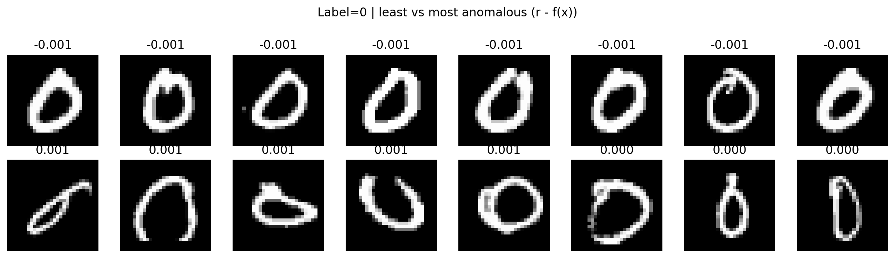
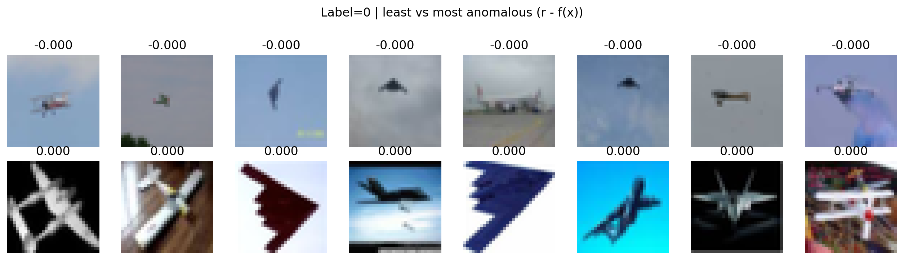

# On anomaly detection 
Laboratory repository for one-class anomaly detection on MNIST and CIFAR-10 using Autoencoders and deep one-class objectives, such as OCNN and SVDD.
building upon the formulations introduced in the following articles:

>Chalapathy, R., Menon, A. K., & Chawla, S. (2018).
>One-Class Neural Networks.
>Proceedings of the AAAI Conference on Artificial Intelligence (AAAI).
>https://arxiv.org/abs/1802.06360

>Ruff, L., Vandermeulen, R. A., Görnitz, N., Deecke, L., Siddiqui, S. A., Binder, A., Müller, K.-R., & Kloft, M. (2018).
>Deep One-Class Classification.
>Proceedings of the 35th International Conference on Machine Learning (ICML).
>https://arxiv.org/abs/1801.05365

The goal of this project is not only to obtain good anomaly detection performance, but to study how the representation and the one-class objective interact, through ablations on:

- feature learning (AE vs RCAE),
- one-class objective (SVDD vs OCNN),
- training regime (z-only vs joint),
- hyperparameters (ν, pollution rate, encoder LR).


<details> <summary>How to run the project?</summary>
Create environment (example): 

```
python -m venv ocnn_env
source ocnn_env/bin/activate
pip install -r requirements.txt
```

Let's run the ocnn pipeline!

```
python -m ocnn_main \
  --ae-mode rcae \
  --ocnn-joint \
  --lr-encoder-joint 1e-5 \
  --normal-digit 0 \
  --pollution-rate 0.01 \
  --nu 0.01 \
  --activation linear \
  --ocnn-epochs 250 \
  --ocnn-lr-init 1e-4 \
  --ocnn-lr-finetune 1e-5 \
  --finetune-start-epoch 100 \
  --batch-size 200 \
  --seed 73
```
> Always check the configuration / CLI arguments before running: results depend strongly on ν, encoder LR, and AE pretraining.

</details>

<details><summary> Project structure </summary>

<br>

```
.
├── pipeline/
│   └── run_ae_ocnn.py
│       └── End-to-end pipeline (AE/RCAE pretrain → OCNN train → evaluation/plots)
├── model_utils/
│   ├── train_autoencoder.py
│   │   └── AE MSE training + RCAE pretraining (alternating scheme)
│   ├── train_ocnn.py
│   │   └── OCNN training (z-only or joint) + evaluation utilities
│   └── ocnn_utils.py
│       └── OCNN losses (hyperplane), r-update, violation computation, z extraction
├── models/
│   ├── ae_factory.py
│   │   └── Autoencoder builder (arch selection)
│   └── ocnn.py
│       └── OCNN model (trainable params access, scoring function)
├── utils/
│   ├── const.py
│   │   └── Global constants / default hyperparameters
│   ├── data/
│   │   └── One-class MNIST datamodule + encoding helpers
│   ├── plot_utils.py
│   │   └── Plots: training curves, score distributions, ROC/PR, extremes visualization
│   └run_utils.py
│      └── Run naming, run directory, filesystem utils
│   
│       
├── runs/
│   └── <timestamped_run>/
│       ├── checkpoints/
│       └── plots/
├── ocnn_main.py
│   └── CLI entrypoint (parses args → calls pipeline)
└── README.md
```
</details>

### Pipeline Overview

The pipeline consists of two main stages.

### 1) Representation Learning (AE / RCAE)

In the first stage, a latent representation of normal data is learned using an autoencoder-based model.

- A standard **Autoencoder (AE)** is trained to reconstruct normal images by minimizing the reconstruction error.
- The **Robust Convolutional Autoencoder (RCAE)** extends this approach by introducing a sparse noise component that is alternated with autoencoder updates, improving robustness to outliers and corrupted inputs.

After training, the encoder maps each input sample to a latent representation  
`z ∈ R^d` (e.g. `d = 32`).


### 2) One-Class Learning (SVDD / OCNN)

In the second stage, a one-class objective is applied on top of the learned latent representations `z`.

- **SVDD** learns a compact region in feature space (a hypersphere) that encloses normal samples.
- **OCNN** learns a scoring function `f(x)` together with a threshold `r`, which is updated as a `ν`-quantile of the scores.  
  This enforces that approximately a fraction `ν` of the training samples violates the constraint.

In the current implementation, the OCNN anomaly score is defined as: anom_score(x) = r - f(x).

 ## 🧪 Experiment 1 — OCNN 
 In this experiment we evaluate One-Class Neural Network (OCNN) as a deep one-class objective for anomaly detection on MNIST.
 
Starting from a latent representation z ∈ ℝᵈ learned by an Autoencoder (AE) or Robust Convolutional Autoencoder (RCAE), the One-Class Neural Network (OCNN) learns: a scoring function f(z), a threshold r, such that only a small fraction ν of the training samples violates the one-class constraint. The threshold r is updated iteratively as the ν-quantile of the scores produced by the network.
>Goal.
>Learn a decision function that assigns low scores to normal samples and flags deviations as anomalies.


<details> <summary>Results on Mnist</summary>

### Quantitative Results

| Method | Digit | ν | AUROC | 
|------|-------|----|-------|
| AE + OCNN | 0 | 0.01 | 0.940 | 
| RCAE + OCNN | 0 | 0.01 | 0.941 | 
| RCAE + OCNN (joint) | 0 | 0.01 | 0.9629 | 
| RCAE + OCNN (joint) | 1 | 0.01 | 0.9681 | 
| RCAE + OCNN (joint) | 2 | 0.01 | 0.8880 | 

### Extreme Normal Samples

The following figure shows the **most anomalous and least anomalous samples among the normal class**, according to the OCNN score.
Even though all samples belong to the same (normal) digit, the model assigns significantly different anomaly scores, highlighting variations in writing style, stroke thickness, and shape complexity.

<p align="center">
  
</p>

</details>

<details> <summary>Results on CIFAR10</summary>

### Quantitative Results

| Method | Digit | ν | AUROC | 
|------|-------|----|-------| 
| RCAE + OCNN (joint) | airplane | 0.1 | 0.6328 | 


**Least vs most anomalous samples (normal class only).**  
The figure shows, for the normal class (label = 0), the samples with the lowest and highest anomaly scores according to the OCNN decision function \( r - f(x) \).

The top row contains the *least anomalous* samples, which correspond to prototypical instances of the class: clear object appearance, canonical viewpoints, and low background clutter.  
The bottom row shows the *most anomalous* samples within the same class. Although still correctly labeled as normal, these images exhibit unusual viewpoints, strong background clutter, scale variations, or atypical visual patterns.

<p align="center">
  
</p>

</details>
